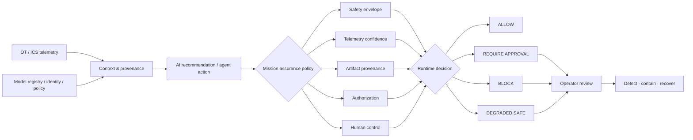

<div align="center">

# InfraGuard AI

### Critical Infrastructure AI Assurance & Mission Resilience

**A defensive simulation for testing whether AI-assisted operational decisions remain safe when telemetry, data, models, identities, or control paths become unreliable.**

[](https://github.com/VinayK88/InfraGuard-AI/actions/workflows/ci.yml)
[](https://www.python.org/)
[](#mission-assurance-model)
[](#security--evaluation-boundary)

**Safety envelopes · provenance · least privilege · human override · degraded-safe operation · resilience testing**

[Use Cases](#what-infraguard-ai-is-used-for) · [Architecture](#architecture) · [Baseline](#baseline-evidence) · [Scenarios](#resilience-scenarios) · [Quick Start](#quick-start) · [Security Boundary](#security--evaluation-boundary)

</div>

---


## Overview

InfraGuard AI is a **critical-infrastructure AI assurance lab** for high-consequence IT/OT/ICS-style environments.

It focuses on a question that model accuracy alone cannot answer:

> **Should an AI-assisted operational decision still be trusted when one or more parts of the surrounding system can no longer be trusted?**

The lab evaluates AI recommendations and agent actions against operational safety constraints, telemetry confidence, artifact provenance, authorization policy, and human-control requirements. The result is an explicit runtime decision rather than an opaque model score.

| Decision | Meaning |
| --- | --- |
| `ALLOW` | Request remains within authorized capability and safe operating bounds. |
| `REQUIRE_APPROVAL` | Human review is required before the action can proceed. |
| `BLOCK` | The requested action violates a hard safety, integrity, or authorization condition. |
| `DEGRADED_SAFE` | Autonomous action is suspended and the system enters a predefined safe state. |

---

## What InfraGuard AI is used for

InfraGuard AI is designed as an **assurance and resilience testing environment** for teams evaluating AI-assisted automation before it is trusted with high-consequence operational decisions.

It is useful when the central question is not simply *“Is the model accurate?”* but rather *“Is the entire decision path safe, authorized, explainable, and resilient when something goes wrong?”*

| Use case | What InfraGuard helps evaluate |
| --- | --- |
| **AI assurance before deployment** | Whether model or agent recommendations remain inside hard operational safety constraints before they can influence a consequential system. |
| **Critical-infrastructure cyber resilience** | How an AI-assisted system behaves when telemetry is spoofed or lost, a model is tampered with, an identity overreaches, or a dependency becomes untrusted. |
| **OT / ICS safety-control validation** | Whether unsafe setpoints are blocked and whether predefined safe states such as manual control or hold-last-safe-setpoint are entered correctly. |
| **AI and data supply-chain integrity** | Whether operational data, feature schemas, model artifacts, and policy bundles match their expected provenance and integrity state. |
| **Least-privilege AI / agent authorization** | Whether an AI service or agent is attempting capabilities beyond the permissions of the target asset or declared task. |
| **Human-in-the-loop design** | Which actions should be autonomous, which require approval, and whether operators can successfully override automation during degraded or unsafe conditions. |
| **Purple-team and resilience exercises** | Replay deterministic synthetic failure and attack scenarios and measure detection, containment, safe-state transition, and recovery behavior. |
| **AI governance and architecture review** | Produce interpretable evidence showing why an action was allowed, blocked, degraded, or escalated to human review. |

### Intended users

The lab is most relevant to:

- **AI security and ML platform teams** evaluating safeguards around model- or agent-driven actions;
- **OT / ICS and critical-infrastructure security teams** exploring safe integration patterns for AI-assisted operations;
- **security architects and resilience engineers** designing trust boundaries, fallback states, and recovery controls;
- **red / purple teams** testing failure modes and control effectiveness in a synthetic environment; and
- **AI governance, risk, and safety teams** that need auditable decision logic rather than model confidence alone.

InfraGuard is a **simulation and engineering lab**, not a production safety controller. Its purpose is to make high-consequence AI assurance concepts concrete, testable, and measurable before they are considered for real operational environments.

---

## Baseline evidence

The repository includes a deterministic synthetic baseline in [`reports/baseline.json`](reports/baseline.json).

| Measure | Baseline |
| --- | ---: |
| **Mission Resilience Score** | **96.0 / 100** |
| Scenarios contained | **6 / 6** |
| Required human overrides successful | **4 / 4** |
| Unsafe actions blocked | **2** |
| Actions requiring approval | **2** |
| Degraded-safe transitions | **1** |
| Provenance health | **75%** |

The reduced provenance score is intentional: the fixture contains one tampered model artifact so the integrity path is exercised rather than presenting an unrealistically perfect system.

> These are **deterministic simulation results**, not production critical-infrastructure performance claims and not an official government resilience metric.

### Resilience dimensions

| Dimension | Score |
| --- | ---: |
| Detection | 100.0 |
| Containment | 100.0 |
| Recovery | 97.5 |
| Human override | 100.0 |
| Data integrity | 75.0 |
| Operational safety | 100.0 |

The scoring logic is intentionally transparent and implemented in [`infraguard/resilience.py`](infraguard/resilience.py).

---

## Mission assurance model

InfraGuard treats the **AI model as one component inside a larger operational trust system**.

A high-confidence recommendation can still be unsafe because the surrounding data, permissions, model artifact, or physical operating constraints may be wrong.

```text
MODEL CONFIDENCE        94%
TELEMETRY CONFIDENCE    94%
MODEL PROVENANCE        VERIFIED
AUTHORIZED CAPABILITY   YES
OPERATIONAL SAFETY      FAIL

DECISION                BLOCK
SAFE STATE              MANUAL_CONTROL
REASON                  Requested setpoint violates hard safety envelope
```

The assurance layer combines five independent control questions:

| Control | Question |
| --- | --- |
| **Operational safety** | Is the requested action inside a predefined safe operating envelope? |
| **Telemetry confidence** | Is the underlying telemetry trustworthy enough for autonomous action? |
| **Artifact integrity** | Are the model, data, feature schema, and policy artifacts verified? |
| **Authorization** | Is the requested capability allowed for the target asset and calling identity? |
| **Human control** | Should the action require approval, manual review, or an operator override? |

---

## Architecture



### Synthetic environment

The lab models six representative assets across IT, operations, DMZ, and OT zones:

- AI decision service
- breaker-control PLC
- transformer cooling controller
- operations historian
- model registry
- operator / HMI console

The asset model is deliberately small enough to audit while still demonstrating trust boundaries, authorization, model/data provenance, operational safety, and human-control transitions.

---

## Assurance controls

### 1. Operational safety envelopes

Consequential setpoints are checked against hard limits before an AI recommendation can become an operational action.

```text
Requested cooling       60%
Minimum safe cooling    78%
Model confidence        94%

Policy result           BLOCK
Safe-state transition   MANUAL_CONTROL
```

This demonstrates a core principle of the project:

**high model confidence does not override physical or operational safety constraints.**

### 2. Telemetry-confidence gating

When primary telemetry becomes unreliable, autonomous operation is reduced rather than silently continuing with stale or low-confidence inputs.

```text
Telemetry confidence    BELOW THRESHOLD
Decision                DEGRADED_SAFE
Safe state              HOLD_LAST_SAFE_SETPOINT
```

### 3. AI and data provenance

InfraGuard verifies deterministic SHA-256 integrity for operational data, feature schemas, model artifacts, and safety-policy bundles.

| Artifact | Baseline status |
| --- | --- |
| Operational sensor window | Verified |
| Feature schema | Verified |
| Model artifact | **Mismatch detected** |
| Safety-policy bundle | Verified |

A provenance failure becomes policy evidence for approval, rollback, or blocking instead of being treated as a passive audit finding.

### 4. Least-privilege action control

The policy engine checks whether an AI service or agent is attempting a capability outside the target asset's permitted action set.

A synthetic attempt to escalate toward PLC write capability is blocked before execution.

### 5. Human override

InfraGuard treats human control as an explicit system state rather than an informal operational assumption.

The synthetic scenario set measures:

- whether human intervention was required;
- whether the override succeeded;
- whether a safe state was entered; and
- how long the system took to recover.

---

## Resilience scenarios

Six deterministic scenarios exercise different failure domains.

| Scenario | Domain | Severity | Detect | Contain | Recover | Response |
| --- | --- | ---: | ---: | ---: | ---: | --- |
| Sensor spoofing against thermal telemetry | Data integrity | 5/5 | 14s | 38s | 150s | `DEGRADED_SAFE` |
| Poisoned retraining window | AI supply chain | 5/5 | 28s | 55s | 260s | `BLOCK_DEPLOYMENT` |
| Agent privilege escalation toward PLC write | Authorization | 5/5 | 3s | 4s | 45s | `BLOCK` |
| Loss of primary telemetry feed | Availability | 4/5 | 11s | 29s | 125s | `HOLD_LAST_SAFE_SETPOINT` |
| Model artifact tampering in registry | Model integrity | 5/5 | 18s | 31s | 210s | `ROLLBACK_MODEL` |
| High-confidence unsafe cooling recommendation | Operational safety | 5/5 | 1s | 1s | 18s | `BLOCK` |

This scenario set is designed to test **mission degradation and recovery**, not only detection accuracy.

---

## What is implemented

<table>
<tr>
<td width="50%" valign="top">

**Runtime assurance**

- Safety-envelope enforcement
- Telemetry-confidence gating
- Provenance verification
- Least-privilege capability checks
- Human approval / override logic
- Safe-state transitions

</td>
<td width="50%" valign="top">

**Resilience evaluation**

- Deterministic scenario replay
- Detect / contain / recover timing
- Mission Resilience Score
- Integrity-failure tracking
- Human-override measurement
- Checked-in baseline evidence

</td>
</tr>
<tr>
<td width="50%" valign="top">

**Engineering**

- Python package + CLI
- FastAPI dashboard / JSON API
- Typed domain models
- Reproducible fixtures
- Docker support
- Unit tests

</td>
<td width="50%" valign="top">

**Quality & governance**

- GitHub Actions on Python 3.10–3.12
- Threat model
- Assurance model
- Framework mapping
- Security boundary documentation
- Explicit non-claims

</td>
</tr>
</table>

---

## Dashboard & API

Run the mission-assurance dashboard locally:

```bash
pip install -e '.[api]'
uvicorn infraguard.api:app --reload
```

Then open:

```text
http://127.0.0.1:8000
```

Available endpoints:

`/healthz` · `/report` · `/scenarios` · `/decisions` · `/provenance` · `/docs`

---

## Quick start

```bash
git clone https://github.com/VinayK88/InfraGuard-AI.git
cd InfraGuard-AI

python -m venv .venv
source .venv/bin/activate

pip install -e '.[api]'

# Evaluate the deterministic baseline
infraguard evaluate

# Run tests
python -m unittest discover -s tests -v

# Regenerate baseline evidence
python scripts/generate_baseline.py
```

### CI quality gate

GitHub Actions validates the project across **Python 3.10, 3.11, and 3.12** and runs:

```text
package install
    ↓
unit tests
    ↓
mission-resilience evaluation
    ↓
baseline generation
    ↓
Python compile check
```

---

## Repository map

```text
InfraGuard-AI/
├── infraguard/
│   ├── api.py              # FastAPI dashboard and endpoints
│   ├── cli.py              # command-line interface
│   ├── fixtures.py         # deterministic synthetic environment
│   ├── models.py           # typed domain objects
│   ├── policy.py           # runtime assurance decisions
│   ├── provenance.py       # integrity verification
│   ├── report.py           # report assembly
│   └── resilience.py       # resilience scoring
├── data/                   # synthetic scenario and policy fixtures
├── reports/
│   └── baseline.json       # checked-in deterministic evidence
├── docs/
│   ├── assurance-model.md
│   ├── framework-mapping.md
│   └── threat-model.md
├── tests/                  # unit and API coverage
├── assets/                 # dashboard preview
├── scripts/                # baseline generation
├── .github/workflows/      # CI matrix
├── Dockerfile
├── SECURITY.md
└── README.md
```

---

## Framework-informed design

InfraGuard is conceptually informed by the **NIST AI Risk Management Framework** and critical-infrastructure AI assurance work.

The implementation maps engineering concepts such as safety constraints, integrity, human control, monitoring, and recovery to a practical simulation. See [`docs/framework-mapping.md`](docs/framework-mapping.md) for the project's interpretation.

**This repository does not claim NIST compliance, certification, government use, or government endorsement.**

---

## Production evolution

A production implementation would require materially stronger controls than this lab, including:

- authorized vendor-specific OT/ICS telemetry;
- redundant and independent sensor validation;
- cryptographic artifact signing and attestation;
- hardware-backed workload and operator identity;
- independent safety-controller boundaries;
- sector-specific hazard analysis;
- formal change control and two-person approval for consequential actions;
- tamper-evident audit trails;
- controlled digital-twin or hardware-in-the-loop validation; and
- organization-specific incident, rollback, and continuity procedures.

---

## Security & evaluation boundary

**Everything in this repository is synthetic and defensive.**

InfraGuard AI does **not** connect to real substations, PLCs, HMIs, SCADA systems, utility networks, transportation systems, defense systems, or other critical infrastructure. It contains no exploit automation, scanning capability, operational credentials, or autonomous physical-control interface.

The project demonstrates software architecture and assurance concepts; it does not establish production safety, sector certification, regulatory compliance, or operational readiness.

See [`SECURITY.md`](SECURITY.md) for the complete boundary.

---

<div align="center">

### Trust the mission, not just the model.

**Critical Infrastructure AI Assurance · Mission Resilience · Human-Controlled Automation**

</div>
