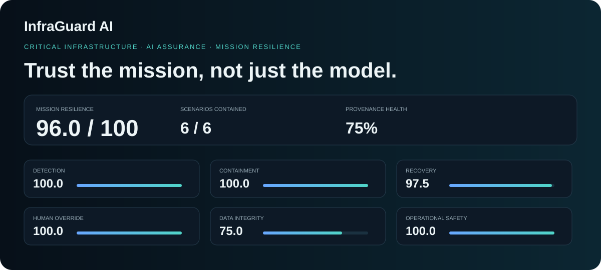
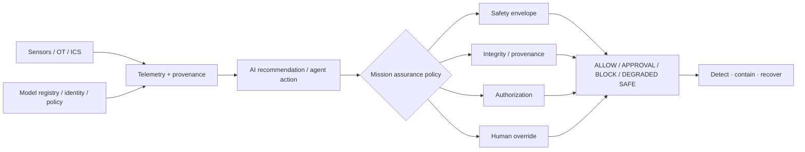

<div align="center">

# InfraGuard AI

### Critical Infrastructure AI Assurance & Mission Resilience Lab

**Operational safety envelopes · AI/data provenance · human override · degraded-safe control · resilience testing**

[](https://github.com/VinayK88/InfraGuard-AI/actions/workflows/ci.yml)
[](https://www.python.org/)
[](#why-this-project)
[](#evaluation-boundary)

> **High model confidence is not the same thing as a safe operational decision.**

</div>

---



InfraGuard AI is a defensive simulation for evaluating AI-assisted decisions in **high-consequence IT/OT/ICS-style environments**. It asks whether an AI recommendation should be trusted when telemetry is degraded, sensor data is spoofed, a model artifact changes, an agent requests excessive privilege, or an otherwise confident recommendation violates an operational safety constraint.

The project is intentionally about **mission assurance**, not predictive accuracy alone.

## Why this project

NIST is actively developing an AI Risk Management Framework profile for **Trustworthy AI in Critical Infrastructure**, reflecting the need to manage AI risk across IT, OT and ICS environments. InfraGuard turns that broad problem into a runnable engineering lab centered on safety, integrity, human control and resilience.

It does **not** claim NIST compliance or government endorsement.

## Core idea



```text
MODEL CONFIDENCE        94%
OPERATIONAL SAFETY      FAIL
PROVENANCE              VERIFIED
AUTHORIZED CAPABILITY   YES

DECISION                BLOCK
Reason                  cooling setpoint violates hard safety envelope
```

## What is implemented

- Synthetic asset model spanning AI services, PLC/controller, historian, model registry and operator console.
- Runtime assurance policy with `ALLOW`, `REQUIRE_APPROVAL`, `BLOCK`, and `DEGRADED_SAFE`.
- Operational safety envelopes for consequential setpoints.
- Least-privilege capability enforcement for AI/agent actions.
- Telemetry-confidence gating and hold-last-safe-setpoint behavior.
- Data/model provenance checks using deterministic SHA-256 integrity verification.
- Human override and manual-control transitions.
- Six resilience scenarios with detect / contain / recover measurements.
- Transparent **Mission Resilience Score** across detection, containment, recovery, human override, integrity and operational safety.
- FastAPI mission-assurance dashboard and JSON/OpenAPI endpoints.
- Unit tests, Docker, and GitHub Actions across Python 3.10–3.12.

## Baseline scenario set

| Scenario | Domain | Severity | Detect | Contain | Recover | Result |
|---|---|---:|---:|---:|---:|---|
| Sensor spoofing against thermal telemetry | Data integrity | 5/5 | 14s | 38s | 150s | Contained |
| Poisoned retraining window | AI supply chain | 5/5 | 28s | 55s | 260s | Contained |
| Agent privilege escalation toward PLC write | Authorization | 5/5 | 3s | 4s | 45s | Blocked |
| Loss of primary telemetry feed | Availability | 4/5 | 11s | 29s | 125s | Degraded-safe |
| Model artifact tampering in registry | Model integrity | 5/5 | 18s | 31s | 210s | Rollback |
| High-confidence unsafe cooling recommendation | Operational safety | 5/5 | 1s | 1s | 18s | Blocked |

These are **synthetic simulation measurements**, not production critical-infrastructure performance claims.

## Safety-envelope example

```text
Requested cooling       60%
Minimum safe cooling    78%
Model confidence        94%
Telemetry confidence    94%

Policy result           BLOCK
Safe-state transition   MANUAL_CONTROL
```

## Provenance example

```text
Artifact                    Status
--------------------------------------
sensor-window               VERIFIED
feature-schema-v3           VERIFIED
grid-load-model-v14         MISMATCH
policy-bundle-v6            VERIFIED
```

A provenance mismatch becomes evidence for blocking or requiring human approval rather than silently trusting an artifact.

## Mission Resilience Score

The score aggregates six transparent dimensions:

**Detection · Containment · Recovery · Human override · Data integrity · Operational safety**

The formula and latency functions are visible in `infraguard/resilience.py`; this is a deterministic engineering score, not an official government metric.

## Dashboard

```bash
pip install -e '.[api]'
uvicorn infraguard.api:app --reload
```

Open `http://127.0.0.1:8000`.

Endpoints: `/healthz` · `/report` · `/scenarios` · `/decisions` · `/provenance` · `/docs`

## Quick start

```bash
git clone https://github.com/VinayK88/InfraGuard-AI.git
cd InfraGuard-AI
python -m venv .venv
source .venv/bin/activate
pip install -e '.[api]'
infraguard evaluate
python -m unittest discover -s tests -v
python scripts/generate_baseline.py
```

## Framework-informed design

The repository is conceptually informed by the **NIST AI Risk Management Framework** and NIST's ongoing **Trustworthy AI in Critical Infrastructure Profile** work. See [`docs/framework-mapping.md`](docs/framework-mapping.md).

This is an engineering interpretation for a portfolio lab—not an implementation of an official profile or a compliance claim.

## Production evolution

A real implementation would require authorized vendor-specific OT/ICS telemetry, redundant sensor validation, cryptographic artifact signing/attestation, hardware-backed identity, independent safety-controller boundaries, formal change control/two-person approval, sector-specific hazard analysis, and controlled digital-twin or hardware-in-the-loop validation before operational use.

## Evaluation boundary

**Everything in this repository is synthetic.** InfraGuard AI does not connect to real substations, PLCs, HMIs, SCADA systems, utility networks, transportation systems, defense systems or other critical infrastructure. It contains no exploit automation, scanning capability, operational credentials or autonomous physical-control interface.

See [`SECURITY.md`](SECURITY.md).

---

<div align="center">

**Trust the mission, not just the model.**

</div>
