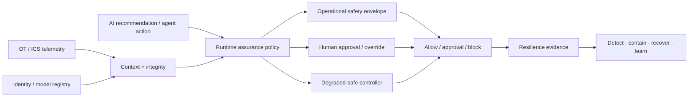

# Architecture

```mermaid
flowchart LR
 OT[OT / ICS telemetry] --> C[Context + integrity]
 IT[Identity / model registry] --> C
 AI[AI recommendation / agent action] --> P[Runtime assurance policy]
 C --> P
 P --> E[Operational safety envelope]
 P --> H[Human approval / override]
 P --> D[Degraded-safe controller]
 E --> O[Allow / approval / block]
 H --> O
 D --> O
 O --> R[Resilience evidence]
 R --> M[Detect · contain · recover · learn]
```
The project separates model confidence from operational authorization and safety.
